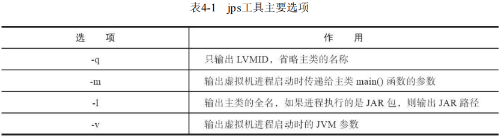
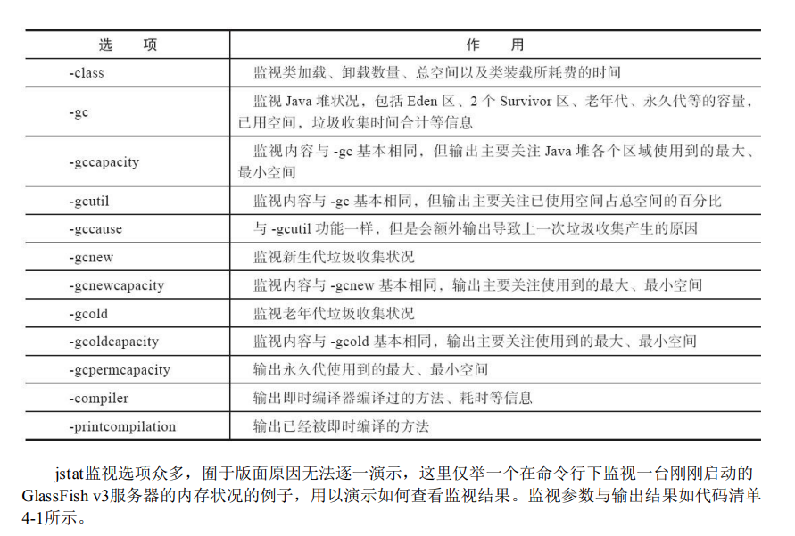
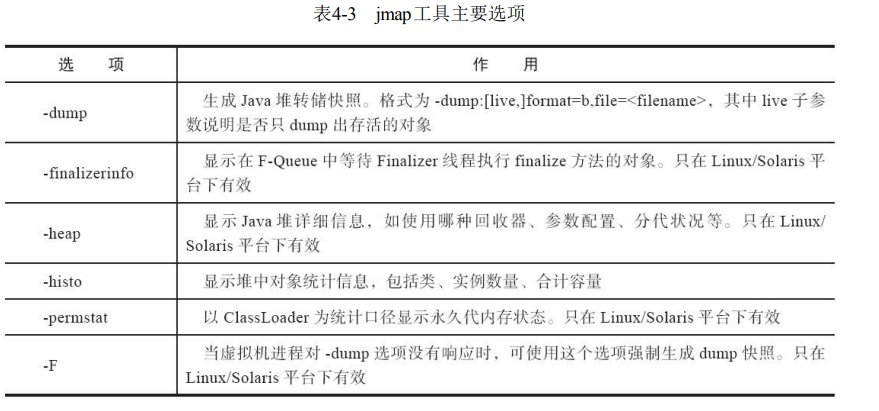

## 虚拟机性能监控鼓掌处理

### 基础故障处理工具

**jps:虚拟机线程状况工具**

**jstat:虚拟机统计信息监控工具**

**jinfo:Java配置信息工具**

jps使用-v参数可以查看启动时显示指定参数,查询所有参数可以通过jinfo

**jmap:Java内存映射工具**

jmap(Memory Map for Java)命令用于生成heap dump文件.通过` -XX +HeapDumpOnOutOfMemmoryError` 参数也可以生成dump文件.

jmap还可以用来查询finalize执行队列,Java堆和方法去详细信息,空间使用率,当前收集器信息等

**Jhat:虚拟机dump分析工具**

用于分析dump文件

**jstack:Java堆栈跟踪工具**

jstack(Stack Trace for Java)命令用于生成theaddump文件快照.

### 可视化故障处理工具

VisualVM

JMC

### 实战:定位并解决线上OOM问题

todo

