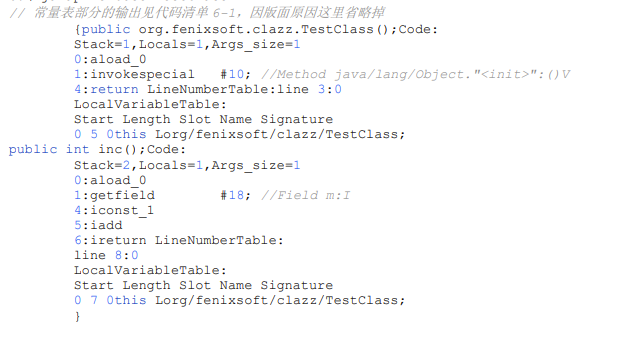

介绍Class文件结构,类加载和虚拟机执行等内容.

### 类文件结构

Java虚拟机只与Class文件这种特定的二进制文件格式关联.有不同的语言编译器javac,jrubyc(用来编译java,ruby语言等).class文件有两种数据类型,**"无符号数"和"表".** 如下图所示,严格按照下图格式顺序排列而成


#### 魔数和class版本

1. magic,minor_version,major_version分别代表魔数,次版本好,主版本号.
2. magic,用来确定该文件是否能被虚拟机接受的Class文件.
3. 版本号标识用于识别当前虚拟机是否可以加载改版本号Class文件.

#### 常量池

常量池主要存放两大常量:**字面量**和**符号引用**. 

1. 字面量:接近Java语言层面的概念,如文本字符串,final常量.
2. 符号引用:符号引用属于编译原理层面的概念,主要包含,类和接口全限定名,字段名称和描述符,方法名称和表述符,方法句柄和方法类型.
3. javac编译的时候,无法得到真正的内存地址.在类加载阶段的解析阶段,才会把常量池获得的符号引用,解析翻译成内存地址.
4. 如何读取常量池:通过常量表tag类型,锁定常量表类型,通过length锁定该常量表的字节长度.

#### 访问标识

标注Class类型类还是接口,是否public,是否abstract,是否final,注解,枚举,模块等

#### 类索引,父类索引,接口索引集合

Class由这三项确定继承关系.

1. 类索引用于确定当前类全限定名.
2. 父类索引用于确定父类全限定名
3. 接口索引集合用于确定类实现了哪些接口

#### 字段表集合,方法表集合

字段(Field)包含,类变量和实例变量.Class文件对方法和字段采取了几乎相同的描述方式.都有以下字段信息

1. 修饰符(public/private/static/final/volatile等)
2. 简单名称和字段描述符
3. 属性表集合

#### 属性表集合

Class文件/字段表/方法表都可以携带自己的属性表集合.以下是常见属性

**Code属性**:存储方法体的代码,一个典型的Code方法体如下图所示,包含了栈深度,布局变量表大小.参数数量,操作指令等.



**ConstantValue属性**: 被final和static修饰的类变量使用ConstantValue属性中的值进行初始化,如果没有被final修饰,将在<clinit>()方法中初始化.

#### 名词解释

1. 简单名称,没有类型和参数修饰的方法或字段名称,如run()方法,private m字段简单明传给你分别是 inc,m;

2. 描述符,举例.前面方法后面描述符

   ```
   void inc()->()V
   java.lang.String toString()->“()Ljava/lang/String
   int indexOf(char[]source，int sourceOffset，int 
   sourceCount，char[]target， int targetOffset，int targetCount，int fromIndex)->([CII[CIII)I
   ```

3. 全限定名,如org/company/TestClass,把类全名.替换为/

------

### 虚拟机类加载机制

类加载机制:Java虚拟机把描述把描述类的数据从Class文件加载到内存,并对数据进行校验,转换解析和初始化.最终形成可以被虚拟机使用的Java类型.

#### 类加载时机

一个类从加载到卸载一个会经历,加载（Loading）、验证（Verification）、准备（Preparation）、解析（Resolution）、初始化（Initialization）、使用（Using）和卸载（Unloading）七个阶段.

必须进行类加载的情况:

1. 使用new关键字实例化对象,读取或设置静态字段,调用静态方法
2. 使用` java.lang.reflect` 包进行反射的时候
3. 初始化父类的时候,如果父类还没有初始化,需要先初始化父类
4. 虚拟机启动时初始化主类
5. 使用动态语言支持时,方法句柄对应的类序号初始化.
6. 当一个接口中定义了JDK 8新加入的默认方法（被default关键字修饰的接口方法）时，如果有这个接口的实现类发生了初始化，那该接口要在其之前被初始化。

#### 加载

类加载阶段需要完成以下三件事情:

1)通过一个类的全限定名称定义此类的二进制字节流

2)将这个字节流所代表的静态存储结构转换为方法区的运行时数据

3)在堆内存中生成一个` java.lang.Class` 对象,作为方法区这个类的各种数据访问入口

**用途**: 比如从zip压缩包中读取,运行时计算,动态代理技术,从其他格式文件生成jsp文件,从加密文件获取.

数组类本身不能通过类加载器创建,如果是引用类型,则采用加载过程递归加载.

加载和连接阶段的部分动作如验证是交叉进行的

#### 验证

**目的**:确保Class字节流信息符合虚拟机规范要求,保护虚拟机自身安全

阶段:

1. 文件格式验证:是否魔数开头,版本号是否符合,常量池类型.验证完成后,字节流进入虚拟机方法区
2. 元数据验证:是否有父类,是否集成不允许被继承的类,是否实现接口放.对java语义进行校验
3. 字节码验证:确实程序语义是合法的,符合逻辑的. 比如操作树栈里面的数据符合指令类型,向上转型正确 等.
4. 符号引用验证: 通过全限定名是否能找到类;指定类中是否存在对应的字段描述符和方法描述符,名称等信息.

#### 准备

**目的:**

1. 准备阶段时是为静态变量分配内存并设置初始值,并不会进行赋值动作.比如int初始值0,reference初始值null但如果**类字段**属性表中存在ConstantValue属性,则初始值是ConstantValue指定的初始值.
2. 设置对象头.这个书里没有提到,但我觉得会设置.

注意 1.类变量存储在堆中 2.实例变量会在对象实例后,随对象一起分配在堆中,准备阶段并不会给实例变量分配内存.

关于类变量存储在方法区中,是一种逻辑概念描述描述.虚拟机规范没有描述方法区如何实现,hotspot用堆来实现方法区.

#### 解析

解析阶段是Java虚拟机将常量池的符号引用替换为直接引用的过程.

* 符号引用（Symbolic References）：描述编译后class文件信息的符号.
* 直接引用（Direct References）:直接引用是可以直接指向目标的指针、相对偏移量或者是一个能间接定位到目标的句柄。直接引用是和虚拟机实现的内存布局直接相关的，同一个符号引用在不同虚拟机实例上翻译出来的直接引用一般不会相同。如果有了直接引用，那引用的目标必定已经在虚拟机的内存中存在。

#### 初始化

初始化阶段,执行类构造器<clinit>()方法(编译器自动生成),即给static变量赋值和执行static代码块.

#### 类加载器

**定义**: 实现上述加载过程的动作(通过一个类的全限定名获取描述该类的二进制自己流)是放在虚拟机外实现的,这个动作实现代码被称为"类加载器".

类加载器是Java技术体系非常重要,在类层次划分,程序热部署,热加载,代码加密等领域大放异彩.

**特点**:

1. 类加载器与类:类是否相同,由类加载器和Class文件两个因素来决定.

2. **双亲委派模型**

   三层类加载器概念:

   * 启动类加载器(Bootstrap Class Loader):负责加载Java_home/lib目录,包含rt.jar tools.jar等
   * 扩展类加载器(Extension Class Loader):负责加载Java_home/lib/ext目录下包,ext目录用户拓展Java标准类库.
   * 应用类加载器(Application Class Loader):负责加载用户类路径(Classpath)下的所有类库.

   **双亲委派模型工作过程**:当一个类收到类加载的请求,它不会自己去加载该类,而是请求上层类加载器去加载.只有上层类加载器无法完成加载动作,当前类加载器才会尝试自己去完成加载.

   **双亲委派模型破坏**:

   1. 比如ServiceLoader,通过META-INF/sevice中的配置信息,和责任链模式来进行逆向加载.  
   2. JNDI引用数据源   
   3. 为了准求动态性OSGi的类加载器

**应用:**

1. tomcat早期版本基于双亲委派模式的加载器架构.

#### Java模块化系统

模块的载体是jar文件,但模块目录下多了一个module-info.class文件,包含以下信息:

- 模块名称
- 依赖哪些模块
- 导出模块内的哪些包（允许直接 `import` 使用）
- 开放模块内的哪些包（允许通过 Java 反射访问）
- 提供哪些服务
- 依赖哪些服务

用途:

1. 根据模块描述分析依赖关系.
2. 精简JRE.
3. 更好的类可见性,通过`exports` 控制类对外开放使用还是内部使用.

模块类加载器对双亲委派的破坏:

在平台类加载器委托上层类加载之前,判断该类能归属到某一个模块中,则委托改模块的加载器完成加载.

------

### 虚拟机字节码执行引擎

#### 栈帧结构

栈帧(Stack Frame)是用于支持方法调用和方法执行的数据结构,包含**局部变量表,操作数栈.动态连接,方法返回地址等信息.**

**布局变量表**:

用于存放方法参数和方法体内部变量.其中每个变量槽只能存放一个boolean,byte,char,short,int ,float ,reference变量.对于long double数据采用高位对齐方式分配连续两个变量槽.

**操作数栈:**

在方法执行的时候,会有各种字节码指令向操作数栈写入或提取内容.

**动态连接:**

每个栈帧都包含一个运行时常量池的方法符号引用.动态连接指运行期将符号引用转换为直接引用.

参考动态分派的概念.

**方法返回地址:**

在栈帧中保存方法返回地址,为了让方法回到被调用的位置,让程序继续执行.

**附加信息:**

调试信息,性能数据等


#### 方法调用

目的:为了确定方法的执行版本,不等同于方法被执行.

**解析**: 非虚方法类加载的解析阶段就可以确定调用版本.非虚方法指被``invokestatic,ivokespecial `

或被final修饰的方法.Java语言层面是静态方法,实例构造器,私有方法,和父类中的方法.这就是解析阶段需要完成的工作.

**分派**: 分派指无法在编译间无法确定方法调用版本,那需要在运行时期确定方法调用版本的调用形式.

静态分派:依赖静态类型来决定方法执行版本.这也是解析的一种.

**动态分派:**

* 根据运行期时间类型(动态类型)来确定方法执行版本,这和`invokevitual` 指定实现息息相关,即`invokevirtual` 获取操作数栈顶第一个元素 C,改元素中能找到该方法则立刻执行.
* **实现**:各个虚拟机实现可能不同,为了解决频繁去方法区搜索目标方法带来的性能问题,会建立虚方法表用于存放各个方法的实际入口地址.

#### 动态类型语言支持

编译期进行类型检查的的语言就是静态语言.运行期类型检查的就是动态语言.

**实现:**`java.lang.invoke ` 通过方法句柄确定目标方法.代码层面就是`MethodHandle` 一个函数

#### 字节码执行引擎

Javac编译器完成了词法分析,语法分析,抽象语法树,遍历语法树生成线性字节码指令流.

**Java解释执行**:

Java通过基于栈的指令架构执行指令,通过程序计数器,布局变量表和操作数栈项目配合完成指令执行.

解释器读取字节码中方法Code指令,程序计数器指向正在执行指令的地址.局部变量存储方法的参数和本地变量,计算过程则在操作数栈中完成.


