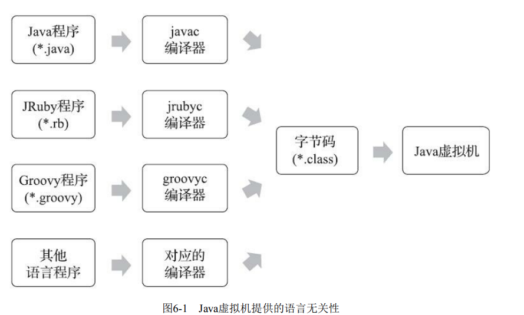
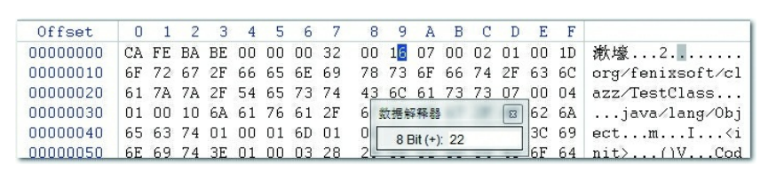

## 类文件结构

Java虚拟机只与Class文件这种特定的二进制文件格式关联.有不同的语言编译器javac,jrubyc等

class文件有两种数据类型,无符号数和表.

文件结构:

1)**魔数:** 前4个字节为魔数0xCAFEBABE

2)**版本号:** 第5~6字节为次版本号,7~8主版本号.主版本号输出0X0032,十进制50则表示被JDK6以上的虚拟机支持编译.虚拟机拒绝执行超过其版本号的class文件

3)**常量池:** 常量池入口有一个u2类型的数据.如图显示0X0016,十进制22.表示有21项常量.

常量池包含字面量和符号引用两种类型常量.当虚拟机进行类加载的时候,将从常量池获得对应的符号引用.

常量池数据给字段表,方法表等提供引用

4)**访问标识:** 是否为public类型,是否final,是否是接口,是否abstract等

5)类索引,父类索引,接口索引等

6)字段表集合

7)方法表集合等

#### 属性表集合

在字段表/方法表都可以携带自己的属性表集合,这里列举几个,详细的参考<<深入理解Java虚拟机>>第三版6.3.7节内容.

1)Code属性,方法体编译后存储在Code属性.

max_locals代表局部变量表所需要的存储空间.由局部变量数量和类型计算的.

2)Exceptions属性,记录首检异常.

3)LineNumberTable属性记录java源码行号,和字节码行号

4) LocalVariableTable 记录局部变量表中名称.

------

## 虚拟机类加载机制

java虚拟机把描述把描述类的数据从Class文件加载到内存,并对数据进行校验,转换解析和初始化.最终形成可以被虚拟机翟杰使用的Java类型,这个过程被称为虚拟机类加载机制.Java语言类型加载连接和初始化过程都是在程序运行期间完成的.

### 类加载时机

一个类从加载到卸载一个会经历,加载（Loading）、验证（Verification）、准备（Preparation）、解析（Resolution）、初始化（Initialization）、使用（Using）和卸载（Unloading）七个阶段.

Java虚拟机强制规定了必须进行"初始化"步骤的情况:

1)使用new关键字实例化对象,读取或设置静态字段,调用静态方法

2)使用` java.lang.reflect` 包进行反射的时候

3)初始化父类的时候,如果父类还没有初始化,需要先初始化父类

4)虚拟机启动时初始化主类

5)使用动态语言支持时,方法句柄对应的类序号初始化.

6)当一个接口中定义了JDK 8新加入的默认方法（被default关键字修饰的接口方法）时，如果有
这个接口的实现类发生了初始化，那该接口要在其之前被初始化。

#### 加载

类加载阶段需要完成以下三件事情:

1)通过一个类的全限定名称定义此类的二进制字节流

2)将这个字节流所代表的静态存储结构转换为方法区的运行时数据

3)在堆内存中生成一个` java.lang.Class` 对象,作为方法区这个类的各种数据访问入口

特点:

很多功能都是通过加载实现的:比如从zip压缩包中读取,运行时计算,动态代理技术,从其他格式文件生成jsp文件,从加密文件获取.

数组类本身不能通过类加载器创建,如果是引用类型,则采用加载过程递归加载.

加载和连接阶段的部分动作如验证是交叉进行的

#### 验证

目的:确保Class字节流信息符合虚拟机规范要求,保护虚拟机自身安全

阶段:

* 文件格式验证:是否魔数开头,版本号是否符合,常量池类型.验证完成后,字节流进入虚拟机方法区
* 元数据验证:是否有父类,是否集成不允许被继承的类,是否实现接口放.对java语义进行校验
* 字节码验证:确实程序语义是合法的,符合逻辑的. 比如操作树栈里面的数据符合指令类型,向上转型正确 等.
* 符号引用验证: 通过全限定名是否能找到类;指定类中是否存在对应的字段描述符和方法描述符,名称等信息.

#### 准备

准备阶段时是为静态变量分配内存并设置初始值,并不会进行赋值动作.比如int初始值0,reference初始值null

但如果类字段属性表中存在ConstantValue属性,则初始值是ConstantValue指定的初始值.

#### 解析

解析阶段是Java虚拟机将常量池的符号引用替换为直接引用的过程.

·符号引用（Symbolic References）：描述编译后class文件信息的符号.

·直接引用（Direct References）:

直接引用是可以直接指向目标的指针、相对偏移量或者是一个能间接定位到目标的句柄。直接引用是和虚拟机实现的内存布局直接相关的，同一个符号引用在不同虚拟机实例上翻译出来的直接引用一般不会相同。如果有了直接引用，那引用的目标必定已经在虚拟机的内存中存在。

#### 

