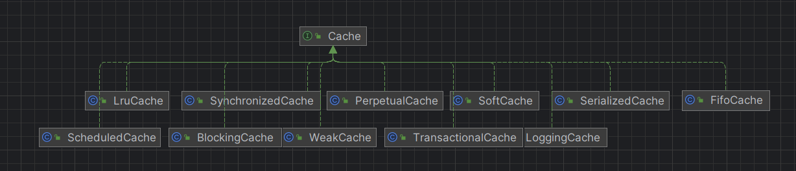

[TOC]

### Mybatis类型处理器

`org.apache.ibatis.type` mybatis包出来处理Java对象和数据库之间的关系.`TypeHander 和 BaseTypeHandler` 分别是类型处理器接口和类型处理基类.如下图所示


#### BaseTypeHandler 基类处理器

`BaseTypeHandler` 中使用到了模板方法,如`getResult(ResultSet,String)` 方法具体实现委托给了抽象方法 `getNullableResult(ResultSet,String)` ,抽象方法由子类实现.

`BaseTypeHandler` 有四个抽象方法:

```
void setNonNullParameter(PreparedStatement ps, int i, T parameter, JdbcType jdbcType);
T getNullableResult(ResultSet rs, String columnName) throws SQLException;
T getNullableResult(ResultSet rs, int columnIndex) throws SQLException;
T getNullableResult(CallableStatement cs, int columnIndex) throws SQLException;
```

分别表示:

1. 像`PerparedStatement` 对象的置顶变量位置写入一个不为null的值.
2. 从`ResultSet` 中按照字段名称读出一个可能为null的数据
3. 从`ResultSet` 中按照字段编号读出可能为null的数据
4. 从`CallableStatement` 中读出可能为null的数据.

#### TypeReference 类

用来获取`TypeHandler` 接口泛型参数`T` 类型.

#### 类型注册表

`TypeHandlerRegistry` 注册类型数据处理信息,具体工作过程是:1.根据Java类型,找到`jdbcTypeHandleMap`,在通过`jdbdHandlerMap`知道JDBC类型对应的`TypeHandle`

例如，在给定 Java类型是 String，而 JDBC类型是 varchar后，就能唯一确定一个类型处理器。getTypeHandler 方法完成的就是这一过程，该方法带注释的源码如下:

```
private <T> TypeHandler<T> getTypeHandler(Type type, JdbcType jdbcType) {
    if (ParamMap.class.equals(type)) { // 是ParamMap，因此不是单一的Java类型
      return null;
    }

    // 先根据Java类型找到对应的jdbcHandlerMap
    Map<JdbcType, TypeHandler<?>> jdbcHandlerMap = getJdbcHandlerMap(type);
    TypeHandler<?> handler = null;
    if (jdbcHandlerMap != null) { // 存在jdbcHandlerMap
      // 根据JDBC类型找寻对应的处理器
      handler = jdbcHandlerMap.get(jdbcType);
      if (handler == null) {
        // 使用null作为键进行一次找寻，通过本类源码可知当前jdbcHandlerMap可能是EnumMap也可能是HashMap
        // EnumMap不允许键为null，因此总是返回null。HashMap允许键为null。这是这并不是一次无用功
        handler = jdbcHandlerMap.get(null);
      }
      if (handler == null) {
        // 如果jdbcHandlerMap只有一个类型处理器，就取出他
        handler = pickSoleHandler(jdbcHandlerMap);
      }
    }
    // 返回找到的类型处理器
    return (TypeHandler<T>) handler;
  }

```


### 使用动态代理接替JDBC日志输出.

JDBC中日志输出有自己的实现,mybatis如何统一jdbc日志输出?

以`ConnectionLogger` 举例,这个类增强JDBC中`Connection` 日志输出,`ConnectionLogger` 实现 `InvocationHandler` 接口,如下图,增强了`prepareStatement`与 `prepareCall` 日志输出.

```
 @Override
  public Object invoke(Object proxy, Method method, Object[] params)
      throws Throwable {
    try {
      // 获得方法来源，如果方法继承自Object类则直接交由目标对象执行
      if (Object.class.equals(method.getDeclaringClass())) {
        return method.invoke(this, params);
      }
      if ("prepareStatement".equals(method.getName())) { // Connection中的prepareStatement方法
        if (isDebugEnabled()) { // 启用Debug
          // 输出方法中的参数信息
          debug(" Preparing: " + removeBreakingWhitespace((String) params[0]), true);
        }
        // 交由目标对象执行
        PreparedStatement stmt = (PreparedStatement) method.invoke(connection, params);
        // 返回一个PreparedStatement的代理，该代理中加入了对PreparedStatement的日志打印操作
        stmt = PreparedStatementLogger.newInstance(stmt, statementLog, queryStack);
        return stmt;
      } else if ("prepareCall".equals(method.getName())) { // Connection中的prepareCall方法
        if (isDebugEnabled()) { // 启用Debug
          debug(" Preparing: " + removeBreakingWhitespace((String) params[0]), true);
        }
        // 交由目标对象执行
        PreparedStatement stmt = (PreparedStatement) method.invoke(connection, params);
        // 返回一个PreparedStatement的代理，该代理中加入了对PreparedStatement的日志打印操作
        stmt = PreparedStatementLogger.newInstance(stmt, statementLog, queryStack);
        return stmt;
      } else if ("createStatement".equals(method.getName())) { // Connection中的createStatement方法
        // 交由目标对象执行
        Statement stmt = (Statement) method.invoke(connection, params);
        // 返回一个Statement的代理，该代理中加入了对Statement的日志打印操作
        stmt = StatementLogger.newInstance(stmt, statementLog, queryStack);
        return stmt;
      } else { // 其它方法
        return method.invoke(connection, params);
      }
    } catch (Throwable t) {
      throw ExceptionUtil.unwrapThrowable(t);
    }
  }

```

### Mybatis如何绑定Java方法和SQL语句

MapperMethod类维护这绑定Mapper接口方法和*mapper.xml 中的定义的sql语句.一方面,mybatis会在加载的时候解释xml文件,另一方面Mapper接口方法会在执行的时候通过动态代理,将查询方法委托为MapperMethod类

### Mybatis 数据源

#### 池化数据源

在Mybatis 中配置`<dataSource type="POOLED">` 来巴适池化数据源

```
<dataSource type="POOLED">
  <property name="driver" value="${driver}"/>
  <property name="url" value="${url}"/>
  <property name="username" value="${username}"/>
  <property name="password" value="${password}"/>
</dataSource>
```

`PooledDataSource#popConnection ()` 新增连接

过程:

1. 如果有空间连接,则去除连接
2. 没有空闲连接,连接池没超出最大限制,创建新的连接
3. 超出连接池最大限制,等待规划连接

### Mybatis缓存机制

**优点**:缓存可以显著降低查询数据库的次数,提升Mybatis 性能.

**源码解析**

1. 装饰器模式

   `org.apache.ibatis.cache` 包使用了典型的装饰器模式,如图`Cache` 接口及其子类类图.

   

   其中`PerpetualCache`是实现类,其他的都是装饰类.

2. 缓存键实现

   Mybatis通过CacheKey实现缓存键,实现如下:

   ```
     // 乘数，用来计算hashcode时使用
     private final int multiplier;
     // 哈希值，整个CacheKey的哈希值。如果两个CacheKey该值不同，则两个CacheKey一定不同
     private int hashcode;
     // 求和校验值，整个CacheKey的求和校验值。如果两个CacheKey该值不同，则两个CacheKey一定不同
     private long checksum;
     // 更新次数，整个CacheKey的更新次数
     private int count;
     // 更新历史
     private List<Object> updateList;

   ```

   更新操作会引起`count,checksum,hashcode`变化

   ```
     public void update(Object object) {
       int baseHashCode = object == null ? 1 : ArrayUtil.hashCode(object);

       count++;
       checksum += baseHashCode;
       baseHashCode *= count;

       hashcode = multiplier * hashcode + baseHashCode;

       updateList.add(object);
     }
   ```

   比较CacheKey相等时,先进行类型判断,然后hashcode,checksum,count比较.以上各项都相同,才会比较updateList,确保不会指针碰撞.

3. 缓存实现

   **3.1 一级缓存:**

   开启:

   1. 在配置文件settings节点下增加配置,`<setting name="localCacheScope"value="SESSION">`
   2. 在xml数据库操作节点可以增加`flushCache=true`, 清除一 二级缓存

   实现:一级缓存再`BaseExecutor` 实现,`BaseExcutor` 归属 `SqlSession` ,因此一级缓存最大作用范围就是`SqlSession`.以下代码实现:

   ```
     /**
      * 从数据库中查询结果
      * @param ms 映射语句
      * @param parameter 参数对象
      * @param rowBounds 翻页限制条件
      * @param resultHandler 结果处理器
      * @param key 缓存的键
      * @param boundSql 查询语句
      * @param <E> 结果类型
      * @return 结果列表
      * @throws SQLException
      */
     private <E> List<E> queryFromDatabase(MappedStatement ms, Object parameter, RowBounds rowBounds, ResultHandler resultHandler, CacheKey key, BoundSql boundSql) throws SQLException {
       List<E> list;
       // 向缓存中增加占位符，表示正在查询
       localCache.putObject(key, EXECUTION_PLACEHOLDER);
       try {
         list = doQuery(ms, parameter, rowBounds, resultHandler, boundSql);
       } finally {
         // 删除占位符
         localCache.removeObject(key);
       }
       // 将查询结果写入缓存
       localCache.putObject(key, list);
       if (ms.getStatementType() == StatementType.CALLABLE) {
         localOutputParameterCache.putObject(key, parameter);
       }
       return list;
     }
   ```

   **3.2二级缓存:**

   开启:

    1.  在配置文件中新增`<setting name="cacheEnaabled" value=true>`,mybatis cnfiguration中默认true,可省略.

   	2. 在xml文件中配置caches属性.如:

       ```
           <cache type="PERPETUAL"
                  eviction="FIFO"
                  flushInterval="60000"
                  size="512"
                  readOnly="true"
                  blocking="true">
           </cache>
       ```

       实现:二级缓存由`CachingExecutor` 实现,在`Configuration newExecutor` 方法实现

       ```
         public Executor newExecutor(Transaction transaction, ExecutorType executorType) {
           executorType = executorType == null ? defaultExecutorType : executorType;
           executorType = executorType == null ? ExecutorType.SIMPLE : executorType;
           Executor executor;
           if (ExecutorType.BATCH == executorType) {
             executor = new BatchExecutor(this, transaction);
           } else if (ExecutorType.REUSE == executorType) {
             executor = new ReuseExecutor(this, transaction);
           } else {
             executor = new SimpleExecutor(this, transaction);
           }
           if (cacheEnabled) {
             executor = new CachingExecutor(executor);
           }
           executor = (Executor) interceptorChain.pluginAll(executor);
           return executor;
         }
       ```

4. **缓存缺点**

   * 二级缓存基于`namespace`实现,可能存在夸空间修改,导致缓存修改不及时.
   * Mybatis 一级 二级缓存都是基于本地实现,分布式环境下可能数据更新不及时

### Mybatis对多语句类型的支持

${}:使用这种符号的变量将会以字符串的形式直接插入到SQL中

`#{}:使用这种符号的变量将会以预编译形式赋值到SQL中

Mybatis中的语句支持

1. STAMENT:只会对SQL片段进行凭借,只支持${}定义变量
2. PREPARED:会先对SQL片段进行拼接,然后对SQL片段赋值.因此,支持使用${},#{}这两种形式定义变量
3. CaLLABLE:这种语句类型用来实现执行过程调用,会先对SQL片段进行字符串拼接,然后对SQL片段进行赋值.因此,支持使用${},#{}这两种形式定义变量.


### Mybatis ErrorContext异常机制

`ErrorContext` 类一个错误上下,它能提前将一些方法执行过程中的信息保存下来,这样真正发生错误时,以便提供信息,给我们排除错误带来便利.

`ErrorContext` 使用单例模式,这个单例模式绑定在 `ThreadLocal` 上.

1. 包装机制,可以存储信息链,新增一个ErrorContext

   ```
     public ErrorContext store() {
       ErrorContext newContext = new ErrorContext();
       newContext.stored = this;
       LOCAL.set(newContext);
       return LOCAL.get();
     }
   ```

   ​

2. 解包

   ```
     public ErrorContext recall() {
       if (stored != null) {
         LOCAL.set(stored);
         stored = null;
       }
       return LOCAL.get();
     }
   ```

### Mybatis对JDBC的封装

简单说明`Executor` 如何来执行SQL.

Mybatis将执行SQL委托给`StatementHandler`接口实现,这个可以实现委托给`Statement`接口调用SQL语句,`StatementHandler`同时持有处理返回结果的接口.以下是代码展示

1. `SimpleExecutor#doQuery()` 方法,参数`StatemetHandler` 与 `ResultHandler`

   ```
     @Override
     public <E> List<E> doQuery(MappedStatement ms, Object parameter, RowBounds rowBounds, ResultHandler resultHandler, BoundSql boundSql) throws SQLException {
       Statement stmt = null;
       try {
         Configuration configuration = ms.getConfiguration();
         StatementHandler handler = configuration.newStatementHandler(wrapper, ms, parameter, rowBounds, resultHandler, boundSql);
         stmt = prepareStatement(handler, ms.getStatementLog());
         return handler.query(stmt, resultHandler);
       } finally {
         closeStatement(stmt);
       }
     }
   ```

2. 在`PreparedStatementHandler` 是`SatementHandler`接口实现类,可以看到query方法中通过`Statement`接口执行SQL.

   ```
     @Override
     public <E> List<E> query(Statement statement, ResultHandler resultHandler) throws SQLException {
       PreparedStatement ps = (PreparedStatement) statement;
       ps.execute();
       return resultSetHandler.handleResultSets(ps);
     }
   ```

   ### Mybatis处理返回结果

   通过上文的`query()` 我们可以看出,通过`resultSetHandler` 变量处理返回接口,这是`ResultSetHandler` 接口实例.这段我们探索如何处理返回结果.

   1. 首先我们明确在JDBC中获取返回结果的方式如下:

      ```
       		// 第三步：创建语句并执行
              Statement stmt = conn.createStatement();
              ResultSet resultSet = stmt.executeQuery("SELECT * FROM `user` WHERE schoolName = \'" + userParam.getSchoolName() + "\';");

              // 第四步：处理数据库操作结果
              List<User> userList = new ArrayList<>();
              while(resultSet.next()){
                  User user = new User();
                  user.setId(resultSet.getInt("id"));
                  user.setName(resultSet.getString("name"));
                  user.setEmail(resultSet.getString("email"));
                  user.setAge(resultSet.getInt("age"));
                  user.setSex(resultSet.getInt("sex"));
                  user.setSchoolName(resultSet.getString("schoolName"));
                  userList.add(user);
              }
      ```

   2. 上文中`handleResultSets()` 处理结果集方法节选,这里是处理定义返回结果为ResultMap的数据

      ```
          //存储处理好的查询结果
          final List<Object> multipleResults = new ArrayList<>();

          int resultSetCount = 0;
          //Statement包装类,存储返回结果ResultSet 类型处理器等
          ResultSetWrapper rsw = getFirstResultSet(stmt);

          List<ResultMap> resultMaps = mappedStatement.getResultMaps();
          int resultMapCount = resultMaps.size();
          validateResultMapsCount(rsw, resultMapCount);
          while (rsw != null && resultMapCount > resultSetCount) {
            ResultMap resultMap = resultMaps.get(resultSetCount);
            //真正的处理返回结果
            handleResultSet(rsw, resultMap, multipleResults, null);
            rsw = getNextResultSet(stmt);
            cleanUpAfterHandlingResultSet();
            resultSetCount++;
          }
      ```

   3.  handleResultSet最终会调用到`getRowValue` 获取数据,这个方法还是比较复杂,赋值工作在`applyAutomaticMappings()` 方法中完成.

      ```
        private Object getRowValue(ResultSetWrapper rsw, ResultMap resultMap, String columnPrefix) throws SQLException {
          final ResultLoaderMap lazyLoader = new ResultLoaderMap();
          Object rowValue = createResultObject(rsw, resultMap, lazyLoader, columnPrefix);
          if (rowValue != null && !hasTypeHandlerForResultObject(rsw, resultMap.getType())) {
            final MetaObject metaObject = configuration.newMetaObject(rowValue);
            boolean foundValues = this.useConstructorMappings;
            if (shouldApplyAutomaticMappings(resultMap, false)) {
              foundValues = applyAutomaticMappings(rsw, resultMap, metaObject, columnPrefix) || foundValues;
            }
            foundValues = applyPropertyMappings(rsw, resultMap, metaObject, lazyLoader, columnPrefix) || foundValues;
            foundValues = lazyLoader.size() > 0 || foundValues;
            rowValue = foundValues || configuration.isReturnInstanceForEmptyRow() ? rowValue : null;
          }
          return rowValue;
        }
      ```

   ​

   ​


