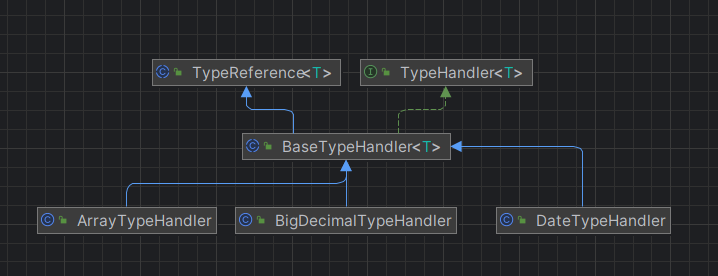

[TOC]


### Mybatis类型处理器

`org.apache.ibatis.type` mybatis包出来处理Java对象和数据库之间的关系.`TypeHander 和 BaseTypeHandler` 分别是类型处理器接口和类型处理基类.如下图所示



#### BaseTypeHandler 基类处理器

`BaseTypeHandler` 中使用到了模板方法,如`getResult(ResultSet,String)` 方法具体实现委托给了抽象方法 `getNullableResult(ResultSet,String)` ,抽象方法由子类实现.

`BaseTypeHandler` 有四个抽象方法:

```
void setNonNullParameter(PreparedStatement ps, int i, T parameter, JdbcType jdbcType);
T getNullableResult(ResultSet rs, String columnName) throws SQLException;
T getNullableResult(ResultSet rs, int columnIndex) throws SQLException;
T getNullableResult(CallableStatement cs, int columnIndex) throws SQLException;
```

分别表示:

1. 像`PerparedStatement` 对象的置顶变量位置写入一个不为null的值.
2. 从`ResultSet` 中按照字段名称读出一个可能为null的数据
3. 从`ResultSet` 中按照字段编号读出可能为null的数据
4. 从`CallableStatement` 中读出可能为null的数据.

#### TypeReference 类

用来获取`TypeHandler` 接口泛型参数`T` 类型.

#### 类型注册表

`TypeHandlerRegistry` 注册类型数据处理信息,具体工作过程是:1.根据Java类型,找到`jdbcTypeHandleMap`,在通过`jdbdHandlerMap`知道JDBC类型对应的`TypeHandle`

例如，在给定 Java类型是 String，而 JDBC类型是 varchar后，就能唯一确定一个类型处理器。getTypeHandler 方法完成的就是这一过程，该方法带注释的源码如下:

```
private <T> TypeHandler<T> getTypeHandler(Type type, JdbcType jdbcType) {
    if (ParamMap.class.equals(type)) { // 是ParamMap，因此不是单一的Java类型
      return null;
    }

    // 先根据Java类型找到对应的jdbcHandlerMap
    Map<JdbcType, TypeHandler<?>> jdbcHandlerMap = getJdbcHandlerMap(type);
    TypeHandler<?> handler = null;
    if (jdbcHandlerMap != null) { // 存在jdbcHandlerMap
      // 根据JDBC类型找寻对应的处理器
      handler = jdbcHandlerMap.get(jdbcType);
      if (handler == null) {
        // 使用null作为键进行一次找寻，通过本类源码可知当前jdbcHandlerMap可能是EnumMap也可能是HashMap
        // EnumMap不允许键为null，因此总是返回null。HashMap允许键为null。这是这并不是一次无用功
        handler = jdbcHandlerMap.get(null);
      }
      if (handler == null) {
        // 如果jdbcHandlerMap只有一个类型处理器，就取出他
        handler = pickSoleHandler(jdbcHandlerMap);
      }
    }
    // 返回找到的类型处理器
    return (TypeHandler<T>) handler;
  }

```


### 使用动态代理接替JDBC日志输出.

JDBC中日志输出有自己的实现,mybatis如何统一jdbc日志输出?

以`ConnectionLogger` 举例,这个类增强JDBC中`Connection` 日志输出,`ConnectionLogger` 实现 `InvocationHandler` 接口,如下图,增强了`prepareStatement`与 `prepareCall` 日志输出.

```
 @Override
  public Object invoke(Object proxy, Method method, Object[] params)
      throws Throwable {
    try {
      // 获得方法来源，如果方法继承自Object类则直接交由目标对象执行
      if (Object.class.equals(method.getDeclaringClass())) {
        return method.invoke(this, params);
      }
      if ("prepareStatement".equals(method.getName())) { // Connection中的prepareStatement方法
        if (isDebugEnabled()) { // 启用Debug
          // 输出方法中的参数信息
          debug(" Preparing: " + removeBreakingWhitespace((String) params[0]), true);
        }
        // 交由目标对象执行
        PreparedStatement stmt = (PreparedStatement) method.invoke(connection, params);
        // 返回一个PreparedStatement的代理，该代理中加入了对PreparedStatement的日志打印操作
        stmt = PreparedStatementLogger.newInstance(stmt, statementLog, queryStack);
        return stmt;
      } else if ("prepareCall".equals(method.getName())) { // Connection中的prepareCall方法
        if (isDebugEnabled()) { // 启用Debug
          debug(" Preparing: " + removeBreakingWhitespace((String) params[0]), true);
        }
        // 交由目标对象执行
        PreparedStatement stmt = (PreparedStatement) method.invoke(connection, params);
        // 返回一个PreparedStatement的代理，该代理中加入了对PreparedStatement的日志打印操作
        stmt = PreparedStatementLogger.newInstance(stmt, statementLog, queryStack);
        return stmt;
      } else if ("createStatement".equals(method.getName())) { // Connection中的createStatement方法
        // 交由目标对象执行
        Statement stmt = (Statement) method.invoke(connection, params);
        // 返回一个Statement的代理，该代理中加入了对Statement的日志打印操作
        stmt = StatementLogger.newInstance(stmt, statementLog, queryStack);
        return stmt;
      } else { // 其它方法
        return method.invoke(connection, params);
      }
    } catch (Throwable t) {
      throw ExceptionUtil.unwrapThrowable(t);
    }
  }

```

### Mybatis如何绑定Java方法和SQL语句

MapperMethod类维护这绑定Mapper接口方法和*mapper.xml 中的定义的sql语句.一方面,mybatis会在加载的时候解释xml文件,另一方面Mapper接口方法会在执行的时候通过动态代理,将查询方法委托为MapperMethod类

### Mybatis 数据源

todo

### Mybatis缓存机制

todo

